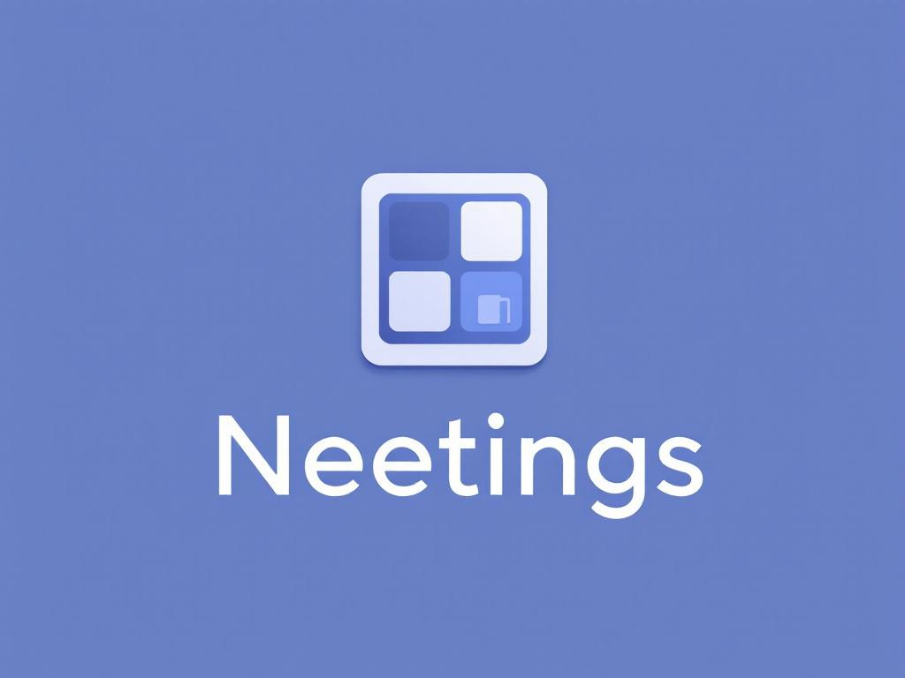

# 📝 Neetings

neatly noted meetings 🤓

### This repository is for discussion and development of Neetings, a modern meeting management platform.

> [!CAUTION]
> The app is currently in public alpha and needs your feedback!

Use the [discussion section](https://github.com/simonneutert/neetings-feedback-public-alpha/discussions) to report bugs, suggest features, or ask questions.

### The Modern Meeting Management Platform That Actually Works

> Transform chaotic meetings notes into organized, actionable outcomes with zero backend complexity

